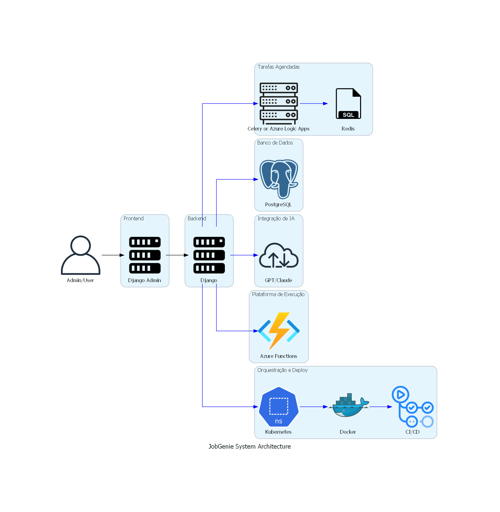

# JobGenie System Design

## Overview

JobGenie is a solution to automate tasks for job seekers, such as job search, contact search, resume analysis, and application tracking. It integrates with AI's like GPT or Claude to create prompts and automate processes.

## Main Components

### Frontend
- **Interface:** Django Admin
- **Functionality:** Administrative interface for manual data entry and results visualization

### Backend
- **Framework:** Django
- **API:** Django REST Framework (DRF)
- **Scheduled Tasks:** Azure Logic Apps or Celery with Redis for scheduling and executing batch tasks
- **AI Integration:** GPT/Claude for generating prompts and automated responses
- **Web Scraping:** Beautiful Soup and Scrapy for scraping contact and job information

### Database
- **Type:** PostgreSQL
- **Stored Data:** User information, contacts, job listings, resumes, activity logs

### Execution Platform
- **Azure Functions:** Execution of serverless functions with scheduling via timers
- **Kubernetes:** Prepared for future orchestration and scalability

### Orchestration and Deployment
- **Docker:** Service containerization
- **Kubernetes:** Container orchestration and management
- **CI/CD:** GitHub Actions for continuous integration and delivery

## Data Flow

1. **System Administration:**
   - Admin accesses Django Admin and manually enters information.
   - Admin views results and task logs.

2. **LinkedIn Contact Search:**
   - Scheduled task initiates the search using web scraping and APIs.
   - Contact data is compared with the existing database and new contacts are stored.
   - Final contact list is generated and stored in the database.

3. **Compatible Job Search:**
   - Scheduled task initiates job search in search engines and social platforms.
   - System checks for duplicates and evaluates job compatibility with the user's resume.
   - Personalized resume is generated for each job.
   - Job information is included in a Notion Kanban.

4. **Followup Helper:**
   - Scheduled task checks stalled tasks in the Notion Kanban.
   - System changes status of stalled tasks and generates follow-up email drafts.

5. **Resume Management:**
   - User registers resume in the system.
   - AI analyzes the resume and provides feedback.
   - Personalized resumes and cover letters are generated for specific jobs.

## Component Diagram

## Technologies Used

- **Frontend:** Django Admin
- **Backend:** Django, Django REST Framework, Celery, Redis
- **Database:** PostgreSQL
- **AI Integration:** GPT or Claude APIs
- **Web Scraping:** Beautiful Soup, Scrapy
- **Execution Platform:** Azure Functions
- **Orchestration and Deployment:** Docker, Kubernetes, GitHub Actions

## Scalability and Future

- **Scalability:** Prepared for Kubernetes orchestration for horizontal scalability.
- **Portability:** Use of Docker containers facilitates migration across different cloud environments.
- **Monitoring:** Implementation of monitoring and logging tools to track performance and detect issues.

## Security

- **Authentication and Authorization:** Use of JWT for API security.
- **Encryption:** Sensitive data should be stored encrypted.
- **Compliance:** Ensure compliance with data protection regulations (e.g., GDPR).

---

For more details on the implementation and development of JobGenie, refer to the [documentation](path/to/documentation).
