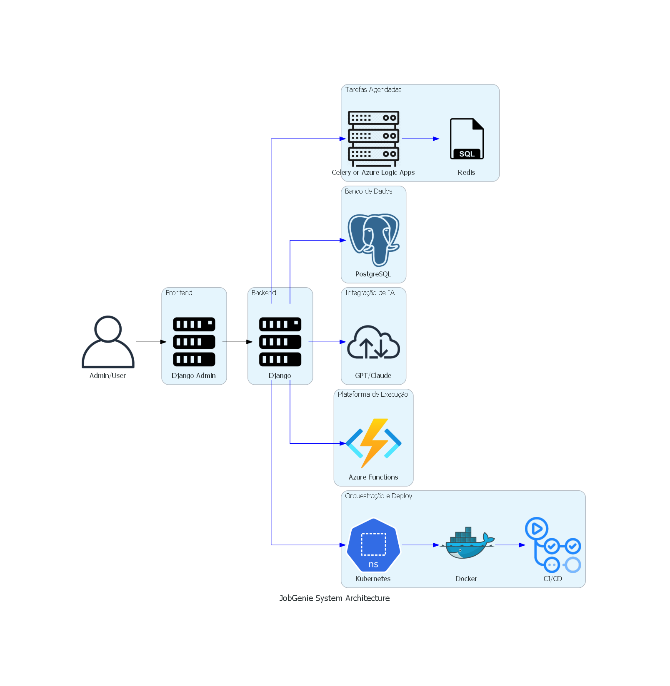

# Arquitetura do Sistema JobGenie

## Visão Geral

O JobGenie é uma solução para automatizar tarefas de candidatos a vagas de emprego, como busca de vagas, busca de contatos, análise de currículo e acompanhamento de candidaturas. Ele integra IA's como GPT ou Claude para criar prompts e automatizar processos.

## Componentes Principais

### Frontend
- **Interface:** Django Admin
- **Funcionalidade:** Interface administrativa para entrada manual de dados e visualização de resultados

### Backend
- **Framework:** Django
- **API:** Django REST Framework (DRF)
- **Tarefas Agendadas:** Azure Logic Apps ou Celery com Redis para agendamento e execução de tarefas em modo batch
- **Integração com IA:** GPT/Claude para geração de prompts e respostas automatizadas
- **Web Scraping:** Beautiful Soup e Scrapy para scraping de informações de contatos e vagas

### Banco de Dados
- **Tipo:** PostgreSQL
- **Dados Armazenados:** Informações de usuários, contatos, vagas, currículos, logs de atividades

### Plataforma de Execução
- **Azure Functions:** Execução de funções serverless com agendamento através de timers
- **Kubernetes:** Preparado para futura orquestração e escalabilidade

### Orquestração e Deploy
- **Docker:** Containerização dos serviços
- **Kubernetes:** Orquestração e gerenciamento de containers
- **CI/CD:** GitHub Actions para integração e entrega contínua

## Fluxo de Dados

1. **Administração do Sistema:**
   - Admin acessa o Django Admin e insere informações manualmente.
   - Admin visualiza resultados e logs de tarefas.

2. **Pesquisa de Contatos no LinkedIn:**
   - Tarefa agendada inicia a pesquisa usando web scraping e APIs.
   - Dados de contatos são comparados com a base existente e novos contatos são armazenados.
   - Lista final de contatos é gerada e armazenada no banco de dados.

3. **Pesquisa de Vagas Compatíveis:**
   - Tarefa agendada inicia a pesquisa de vagas em buscadores e plataformas sociais.
   - Sistema verifica duplicidade e avalia a compatibilidade das vagas com o currículo do usuário.
   - Currículo personalizado é gerado para cada vaga.
   - Informações de vagas são incluídas em um Kanban no Notion.

4. **Followup Helper:**
   - Tarefa agendada verifica tasks paradas no Kanban do Notion.
   - Sistema muda status de tasks paradas e gera rascunho de email de followup.

5. **Gestão de Currículo:**
   - Usuário cadastra currículo no sistema.
   - IA analisa o currículo e fornece feedback.
   - Currículos e cover letters personalizados são gerados para vagas específicas.

## Diagrama de Componentes

## Tecnologias Utilizadas

- **Frontend:** Django Admin
- **Backend:** Django, Django REST Framework, Celery, Redis
- **Banco de Dados:** PostgreSQL
- **Integração de IA:** APIs do GPT ou Claude
- **Web Scraping:** Beautiful Soup, Scrapy
- **Plataforma de Execução:** Azure Functions
- **Orquestração e Deploy:** Docker, Kubernetes, GitHub Actions

## Escalabilidade e Futuro

- **Escalabilidade:** Preparado para orquestração com Kubernetes, permitindo escalabilidade horizontal.
- **Portabilidade:** Uso de containers Docker facilita a migração entre diferentes ambientes de cloud.
- **Monitoramento:** Implementação de ferramentas de monitoramento e logs para acompanhamento do desempenho e detecção de problemas.

## Segurança

- **Autenticação e Autorização:** Uso de JWT para segurança nas APIs.
- **Criptografia:** Dados sensíveis devem ser armazenados de forma criptografada.
- **Compliance:** Garantir conformidade com normas de proteção de dados (ex: GDPR).

---

Para mais detalhes sobre a implementação e desenvolvimento do JobGenie, consulte a [documentação](path/to/documentation).
